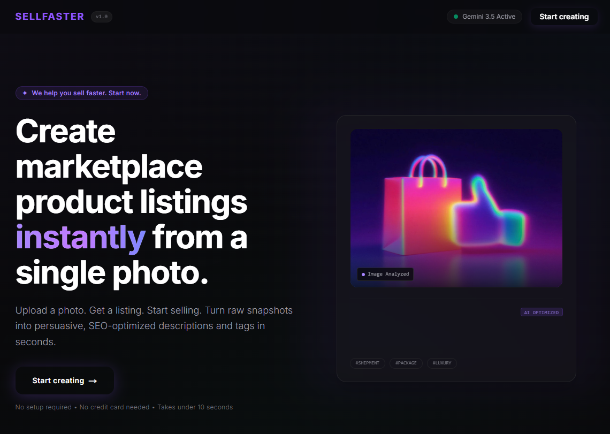
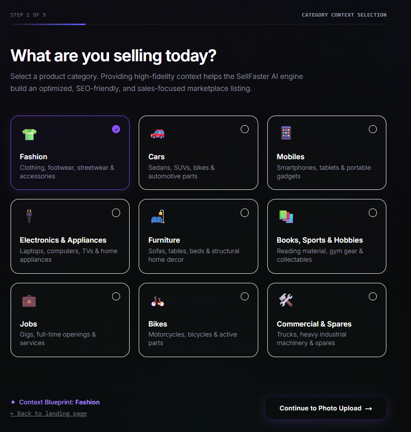
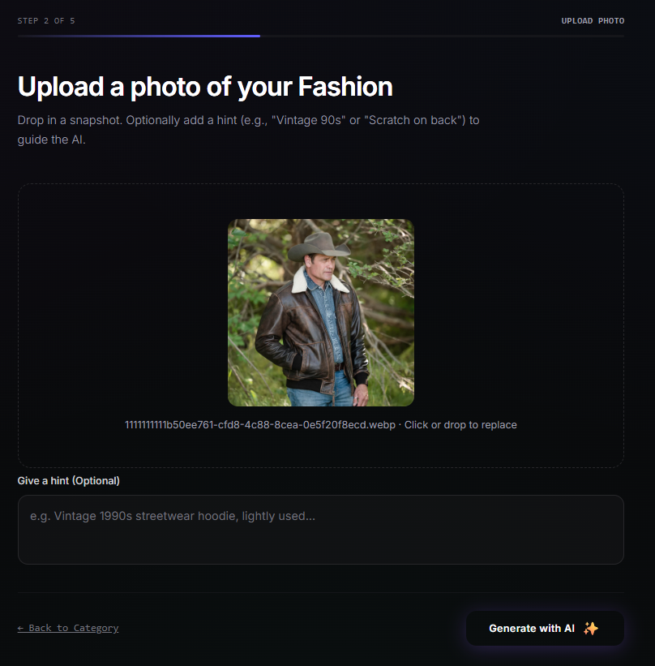
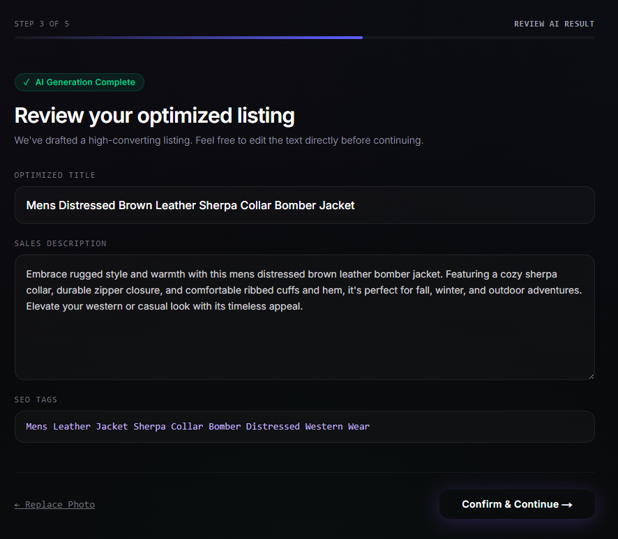
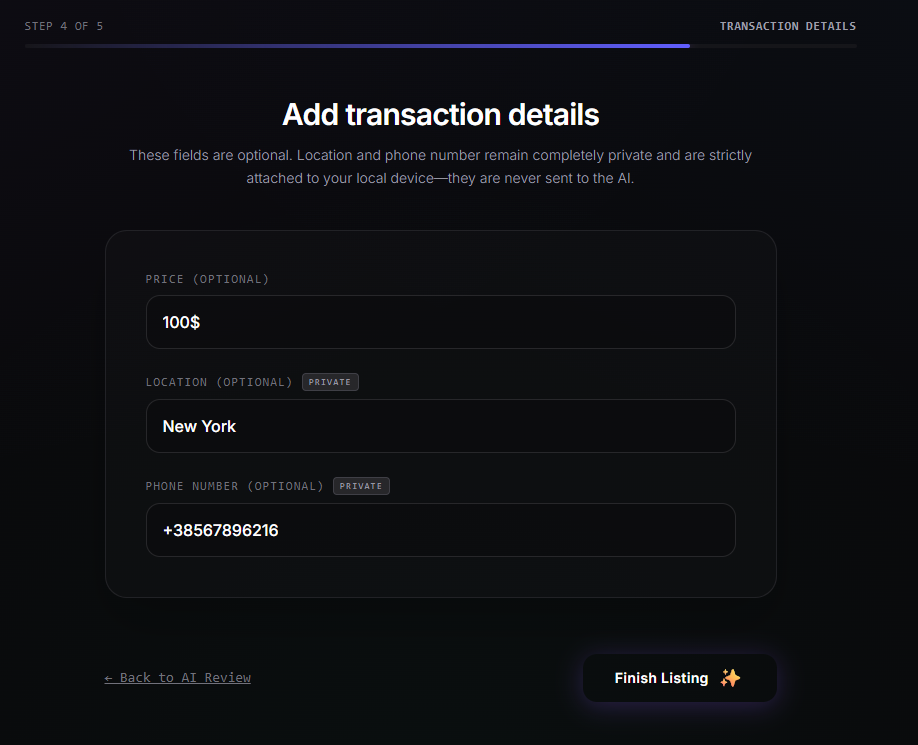
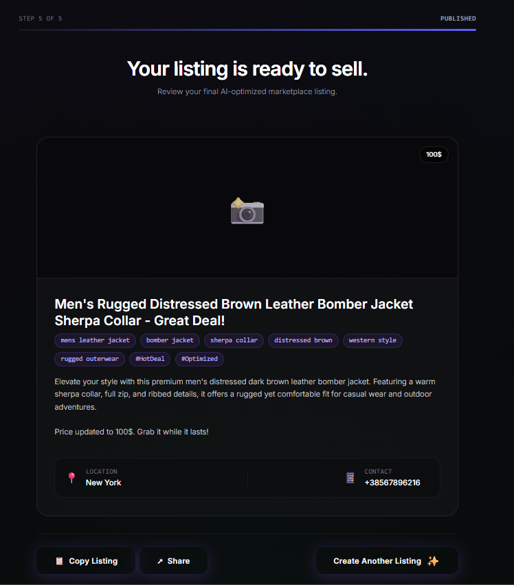

# 🚀 SellFaster AI – Product Listing Generator

SellFaster AI is a full-stack SaaS application that generates optimized marketplace product listings from a single product image using AI.

Users upload a photo, and the system automatically generates:
- SEO-optimized product titles
- Descriptions
- Tags/keywords
- Structured listing content ready for marketplaces

## 🎥 Demo



### Full MVP Flow (5-Step AI Listing Generator)


---

## 🧭 How It Works

### STEP 1 — Category Selection
User selects product category (e.g. Fashion, Electronics, etc.)
Stored in onboarding state.



---

### STEP 2 — Image Upload + Context Hint
User uploads a product image and optionally adds a hint.
👉 This triggers the AI generation request.



---

### STEP 3 — AI Listing Generation
AI generates:
- Title
- Description
- Tags

User can preview and edit results.



---

### STEP 4 — Enrichment (Price + Location)
User adds:
- Price
- Location
- Contact preferences

This enriches the AI-generated listing.



---

### STEP 5 — Final Preview & Publish
Final listing preview is generated.
User can publish or save draft.



---

## 🧾 Generated Listing Example

🔥 Men's Rugged Distressed Brown Leather Bomber Jacket with Sherpa Collar

Price: $100
Location: New York

Description:
Premium men's distressed brown leather bomber jacket designed for durability and everyday wear.

Key Features:
- Genuine distressed leather finish
- Warm sherpa collar for cold weather
- Full zip closure
- Ribbed cuffs and hem for comfort
- Ideal for casual and outdoor styling

Tags:
#leatherjacket #bomberjacket #mensfashion #streetwear #outerwear #winterstyle

---

## ✨ Features

- 📸 Upload product images
- 🧠 AI-powered listing generation
- ⚡ Fast multi-step creation flow
- 📝 Automatic SEO-optimized descriptions
- 💰 Pricing + publishing flow
- 📱 Mobile-first UX design
- 🔄 Step-by-step onboarding experience

---

## 🧱 Tech Stack

### Frontend
- Next.js (App Router)
- React
- TypeScript
- Tailwind CSS
- Zustand (state management)
- React Hook Form
- TanStack Query
- Framer Motion

### Backend
- FastAPI
- Python
- Uvicorn
- Pydantic
- SQLite (local DB for MVP)
- AI integration (Gemini/OpenAI client)

### Dev Tools
- uv (Python package manager)
- ESLint
- Prettier
- Git + GitHub

---

## 📁 Project Structure

```

/backend
├── main.py
├── config.py
├── db.py
├── gemini_client.py
├── pyproject.toml

/frontend
├── src/
│   ├── app/
│   ├── features/
│   ├── shared/
│   ├── context/
│   ├── hooks/
├── package.json
├── next.config.ts

````

---

## ⚙️ How it works

1. User uploads a product image
2. Backend sends image to AI model
3. AI generates structured listing data
4. Frontend displays editable result
5. User publishes or copies listing

---

## 🚀 Getting Started

### 1. Clone repository
```bash
git clone https://github.com/DmytroPonomariov/AI-Product-Listing-Creator.git
cd AI-Product-Listing-Creator
````

---

### 2. Backend setup

```bash
cd backend
uv venv
source .venv/Scripts/activate   # Windows Git Bash
uv pip install -r requirements.txt
uvicorn main:app --reload
```

---

### 3. Frontend setup

```bash
cd frontend
npm install
npm run dev
```

---

## 🌐 Environment Variables

### Backend (.env)

```
API_KEY=your_ai_api_key
DATABASE_URL=sqlite:///app.db
```

### Frontend (.env.local)

```
NEXT_PUBLIC_API_URL=http://localhost:8000
```

---

## 🎯 Project Goal

The goal of SellFaster AI is to eliminate manual listing creation and help users generate high-converting marketplace listings in under 10 seconds using AI automation.

---

## 📌 Future Improvements

* Stripe payments integration
* User authentication
* Cloud image storage (S3)
* Multi-marketplace export (eBay, Etsy, Amazon)
* Advanced AI prompt tuning
* Analytics dashboard

---

## 👨‍💻 Author

Built as a full-stack AI SaaS project for learning and production-level experience.

---
